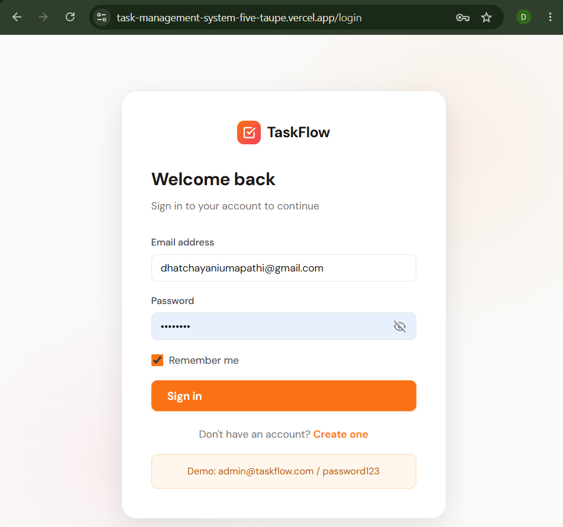
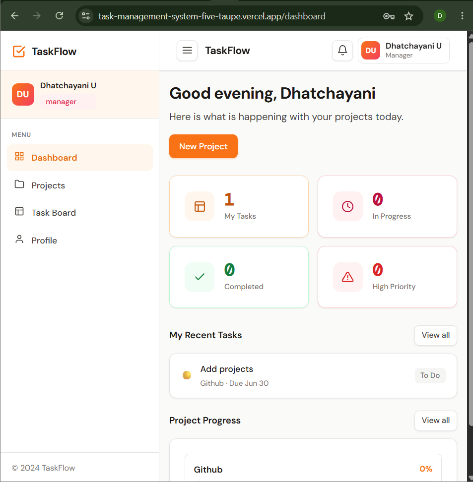
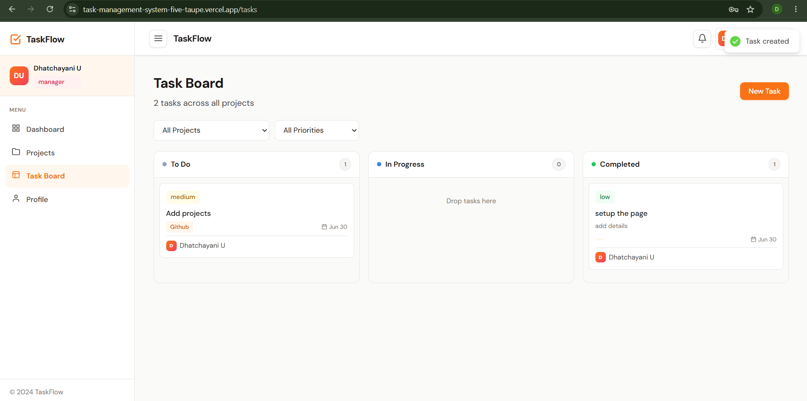
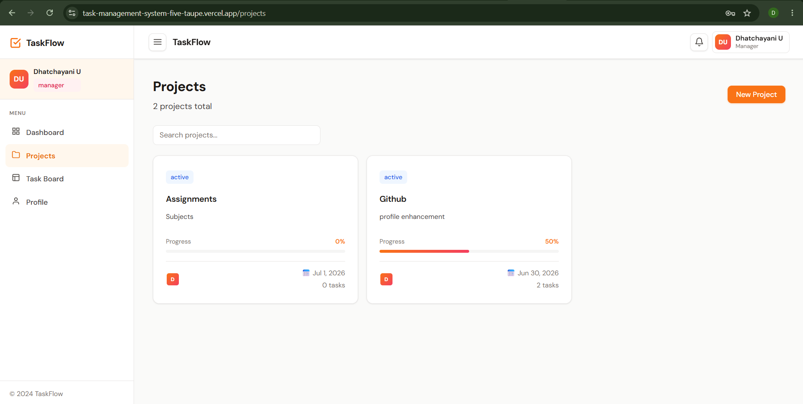

# # TaskFlow – Real-Time Project Management System

TaskFlow is a full-stack MERN project management application that enables teams to collaborate in real time. It provides secure authentication, role-based access control, project and task management, drag-and-drop Kanban boards, live updates using Socket.IO, and an in-app notification system. The application is deployed using Vercel, Render, and MongoDB Atlas.

## Live Demo

Frontend: https://task-management-system-five-taupe.vercel.app

Backend API: https://task-management-system-ztgu.onrender.com/api

## Screenshots

### Login



### Dashboard



### Kanban Board



### Project Details


##  Project Structure

```
taskflow/
├── backend/                    # Node.js + Express API
│   ├── config/
│   │   └── db.js               # MongoDB connection
│   ├── controllers/
│   │   ├── auth.controller.js
│   │   ├── project.controller.js
│   │   ├── task.controller.js
│   │   └── user.controller.js
│   ├── middleware/
│   │   ├── auth.middleware.js   # JWT protect + role authorize
│   │   └── validate.middleware.js
│   ├── models/
│   │   ├── User.model.js
│   │   ├── Project.model.js
│   │   ├── Task.model.js
│   │   └── Notification.model.js
│   ├── routes/
│   │   ├── auth.routes.js
│   │   ├── project.routes.js
│   │   ├── task.routes.js
│   │   └── user.routes.js
│   ├── utils/
│   │   ├── generateToken.js
│   │   └── projectProgress.js
│   ├── server.js               # Express app + Socket.io
│   └── package.json
│
├── frontend/                   # React application
│   ├── public/
│   │   └── index.html
│   ├── src/
│   │   ├── components/
│   │   │   ├── dashboard/      # StatCard, RecentTasks, ProjectProgress
│   │   │   ├── layout/         # AppLayout, Navbar, Sidebar
│   │   │   ├── projects/       # ProjectCard, ProjectModal
│   │   │   └── tasks/          # TaskModal
│   │   ├── context/
│   │   │   └── AuthContext.js  # Global auth state
│   │   ├── pages/
│   │   │   ├── LoginPage.js
│   │   │   ├── RegisterPage.js
│   │   │   ├── DashboardPage.js
│   │   │   ├── ProjectsPage.js
│   │   │   ├── ProjectDetailPage.js
│   │   │   ├── TaskBoardPage.js  # Drag-and-drop Kanban
│   │   │   └── ProfilePage.js
│   │   ├── services/
│   │   │   ├── api.js           # Axios + interceptors
│   │   │   └── socket.js        # Socket.io client
│   │   ├── App.js
│   │   └── index.js
│   └── package.json
│
├── .gitignore
└── README.md
```

---

## 🚀 Local Development Setup

### Prerequisites
- Node.js v18+
- npm v9+
- A free [MongoDB Atlas](https://www.mongodb.com/atlas) cluster

### 1. Clone the repository

```bash
git clone https://github.com/dhatchayaniumapathi/Task-management-system.git
cd Task-management-system
```

### 2. Backend setup

```bash
cd backend
npm install

# Copy example env and fill in your values
cp .env.example .env
```

Edit `backend/.env`:
```
PORT=5000
MONGO_URI=mongodb+srv://<user>:<password>@cluster.mongodb.net/taskflow
JWT_SECRET=pick_a_long_random_string_here
JWT_EXPIRE=7d
NODE_ENV=development
CLIENT_URL=http://localhost:3000
```

```bash
npm run dev        # starts with nodemon on port 5000
```

### 3. Frontend setup

```bash
cd ../frontend
npm install

cp .env.example .env
```

Edit `frontend/.env`:
```
REACT_APP_API_URL=http://localhost:5000/api
REACT_APP_SOCKET_URL=http://localhost:5000
```

```bash
npm start          # starts on port 3000
```

The app will open at **http://localhost:3000**.

---

##  API Reference

### Auth
| Method | Endpoint              | Access  | Description           |
|--------|-----------------------|---------|-----------------------|
| POST   | /api/auth/register    | Public  | Register a new user   |
| POST   | /api/auth/login       | Public  | Login + get JWT       |
| GET    | /api/auth/me          | Private | Get logged-in user    |

### Projects
| Method | Endpoint              | Access           | Description             |
|--------|-----------------------|------------------|-------------------------|
| GET    | /api/projects         | Private          | List accessible projects|
| POST   | /api/projects         | Admin, Manager   | Create a project        |
| GET    | /api/projects/:id     | Private (member) | Project + its tasks     |
| PUT    | /api/projects/:id     | Admin, Manager   | Update project          |
| DELETE | /api/projects/:id     | Admin, Manager   | Delete project + tasks  |

### Tasks
| Method | Endpoint              | Access  | Description                  |
|--------|-----------------------|---------|------------------------------|
| GET    | /api/tasks            | Private | List tasks (filterable)      |
| POST   | /api/tasks            | Private | Create a task                |
| PUT    | /api/tasks/:id        | Private | Update task (incl. status)   |
| DELETE | /api/tasks/:id        | Private | Delete a task                |

### Users
| Method | Endpoint                      | Access  | Description              |
|--------|-------------------------------|---------|--------------------------|
| GET    | /api/users                    | Private | List all users           |
| GET    | /api/users/notifications      | Private | User notifications       |
| PUT    | /api/users/notifications/read | Private | Mark notifications read  |
| PUT    | /api/users/profile            | Private | Update own profile       |

---

##  Role-Based Access Control

| Feature                  | Admin | Manager | Member |
|--------------------------|-------|---------|--------|
| View projects            | ✅ All | ✅ Own  | ✅ Own |
| Create/delete projects   | ✅    | ✅      | ❌     |
| Create tasks             | ✅    | ✅      | ✅     |
| Delete any task          | ✅    | ✅      | ❌     |
| Delete own task          | ✅    | ✅      | ✅     |
| View all users           | ✅    | ✅      | ✅     |

---

##  Advanced Features

### Real-Time Updates (Socket.io)
- Task created/updated/deleted events broadcast to all project room members instantly
- Notifications pushed to assigned user's personal socket room
- No page refresh needed — the Kanban board updates live

### Drag-and-Drop Kanban (`@hello-pangea/dnd`)
- Drag task cards between **To Do → In Progress → Completed** columns
- Status persists to the database with an optimistic UI update
- Smooth drag animations with card rotation on lift

### Notification System
- In-app bell icon in the Navbar with unread count badge
- Notifications created on task assignment
- Real-time delivery via Socket.io to the assignee's room
- Bulk "mark all read" action

### Activity Log (Status History)
- Every task stores a `statusHistory` array
- Each entry records: new status, who changed it, and when

---

##  Deployment

### Step 1 — MongoDB Atlas
1. Create a free cluster at [mongodb.com/atlas](https://www.mongodb.com/atlas)
2. Create a database user with read/write access
3. Whitelist `0.0.0.0/0` (all IPs) under Network Access
4. Copy your connection string — you'll need it for Render

### Step 2 — Backend on Render
1. Push your code to GitHub
2. Go to [render.com](https://render.com) → **New Web Service**
3. Connect your GitHub repo, set **Root Directory** to `backend`
4. Build command: `npm install` | Start command: `node server.js`
5. Add environment variables:
   - `MONGO_URI` = your Atlas connection string
   - `JWT_SECRET` = a strong random string (use `openssl rand -hex 32`)
   - `NODE_ENV` = `production`
   - `CLIENT_URL` = your Vercel frontend URL (add after step 3)
6. Deploy — https://task-management-system-five-taupe.vercel.app (e.g. `https://taskflow-api.onrender.com`)

### Step 3 — Frontend on Vercel
1. Go to [vercel.com](https://vercel.com) → **New Project**
2. Import your GitHub repo, set **Root Directory** to `frontend`
3. Add environment variables:
   - `REACT_APP_API_URL` = `https://taskflow-api.onrender.com/api`
   - `REACT_APP_SOCKET_URL` = `https://taskflow-api.onrender.com`
4. Deploy — https://task-management-system-ztgu.onrender.com/api
5. Go back to Render and update `CLIENT_URL` to your Vercel URL, then redeploy backend

---

##  Git Instructions

### Initialize a new repository

```bash
cd taskflow
git init
git add .
git commit -m "feat: initial TaskFlow project setup"
```

### Create GitHub repository and push

```bash
# Create repo on GitHub first, then:
git remote add origin https://github.com/dhatchayaniumapathi/Task-management-system.git
git branch -M main
git push -u origin main
```

### Recommended branch strategy

```bash
# Feature branches
git checkout -b feature/task-attachments

# After work is done
git add .
git commit -m "feat: add file attachments to tasks"
git push origin feature/task-attachments
# Open a Pull Request on GitHub → merge to main
```

### Commit message conventions
```
feat:     New feature
fix:      Bug fix
refactor: Code restructure, no behavior change
style:    CSS/formatting changes
docs:     Documentation only
chore:    Config, dependencies
```

---

##  Testing the API with cURL

```bash
# Register a user
curl -X POST http://localhost:5000/api/auth/register \
  -H "Content-Type: application/json" \
  -d '{"name":"Admin User","email":"admin@test.com","password":"password123","role":"admin"}'

# Login
curl -X POST http://localhost:5000/api/auth/login \
  -H "Content-Type: application/json" \
  -d '{"email":"admin@test.com","password":"password123"}'

# Get projects (replace TOKEN)
curl http://localhost:5000/api/projects \
  -H "Authorization: Bearer TOKEN"
```

---

##  Security Checklist

- [x] Passwords hashed with bcrypt (salt rounds: 10)
- [x] JWT tokens signed with HS256, expire in 7 days
- [x] Password field excluded from all query results by default
- [x] Role-based middleware on all sensitive routes
- [x] Input validation on all POST/PUT routes
- [x] CORS restricted to `CLIENT_URL` origin
- [x] Environment variables for all secrets (never hardcoded)

---

##  Tech Stack

| Layer       | Technology                            |
|-------------|---------------------------------------|
| Frontend    | React 18, React Router 6              |
| Drag & Drop | @hello-pangea/dnd                     |
| HTTP Client | Axios with request/response interceptors |
| Real-time   | Socket.io (client + server)           |
| Backend     | Node.js, Express.js (MVC)             |
| Auth        | JWT, bcryptjs                         |
| Validation  | express-validator                     |
| Database    | MongoDB, Mongoose ODM                 |
| Hosting     | Vercel (FE), Render (BE), Atlas (DB)  |
